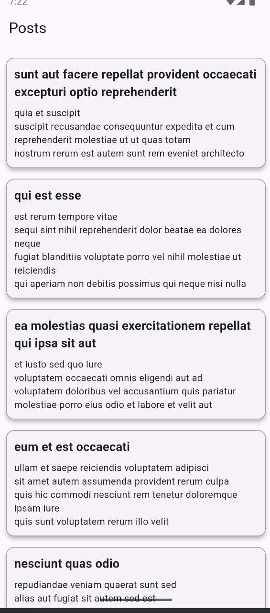

# cubitposts

A new Flutter project.

## Getting Started

This project is a starting point for a Flutter application.

A few resources to get you started if this is your first Flutter project:

- [Lab: Write your first Flutter app](https://docs.flutter.dev/get-started/codelab)
- [Cookbook: Useful Flutter samples](https://docs.flutter.dev/cookbook)

For help getting started with Flutter development, view the
[online documentation](https://docs.flutter.dev/), which offers tutorials,
samples, guidance on mobile development, and a full API reference.
# 🏛️ CubitPosts

A Flutter application that fetches posts from a dummy API using **Clean Architecture** and **Cubit** for state management.

---

## ✨ Features
- Fetches posts from [JSONPlaceholder API](https://jsonplaceholder.typicode.com/posts)
- Implements **Clean Architecture** with **Domain, Data, and Presentation** layers
- Uses **Cubit (Flutter Bloc)** for state management
- Caches posts for better performance
- Supports **manual refresh** to load new posts

---

## 🚀 Getting Started

### **1️⃣ Prerequisites**
Make sure you have:
- **Flutter SDK** installed ([Download Here](https://flutter.dev/docs/get-started/install))
- **Dart** installed
- A working **IDE** (VS Code / Android Studio)

### **2️⃣ Clone the Repository**
git clone https://github.com/yourusername/cubitposts.git
cd cubitposts

### **3️⃣ Install Dependencies And Run App**
flutter pub get
flutter run

